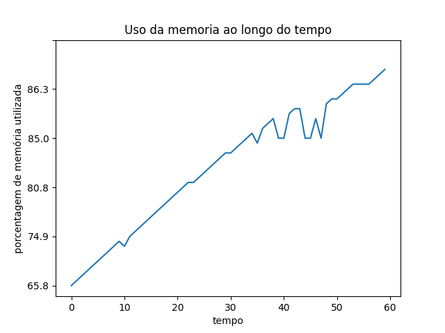
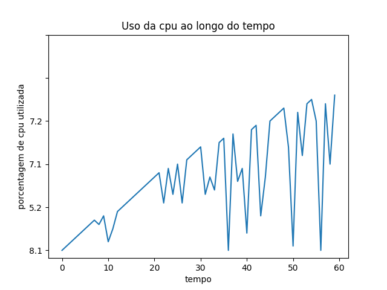
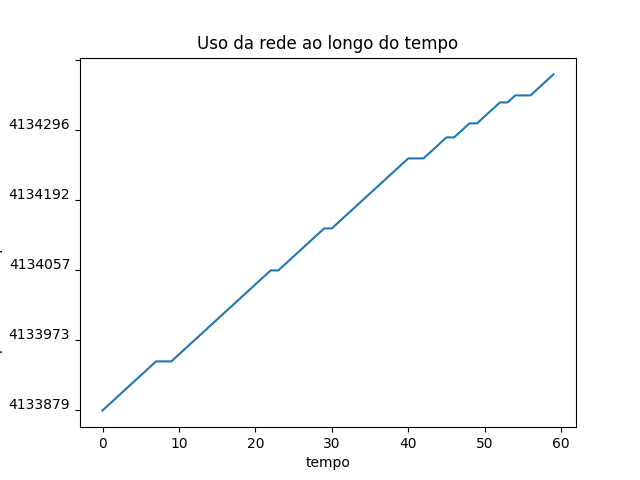
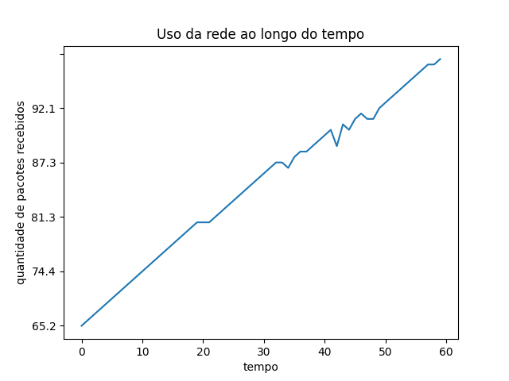
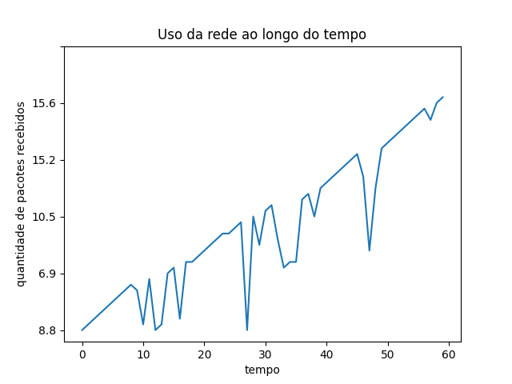
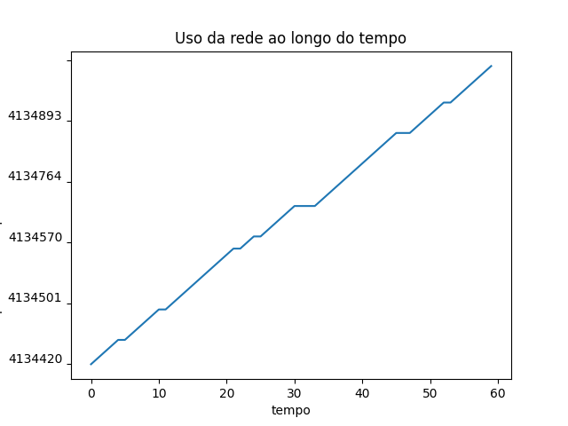

# Serviço echo reply reverse com simulação de ataque DOS

O script client.py vai realizar o envio de diversas mensagens em paralelo para o servidor, enquanto o script servidor.py vai tratar cada requisição do cliente paralelamente.

## **Como executar**

**Cliente:**  ./client.py "tamanho das mensagens em bytes"  

**Exemplo:** ./client.py 50 (_para testes com mensagens de 50 bytes_)

**Servidor:**  ./server.py "tamanho das mensagens em bytes"  

**Exemplo:** ./server.py 50 (_para testes com mensagens de 50 bytes_)

## **Observações**

Com apenas um único cliente, realizando requisições em paralelo o computador atingiu 100% de uso da CPU com clientes mandando mensagens de 100 bytes.

## **Gráficos de teste com 50 bytes**

## **Gráficos de teste com 100 bytes**

